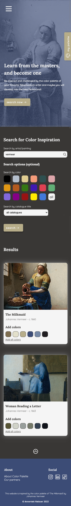
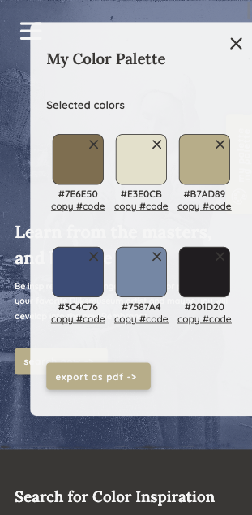

# My Color Palette - React App

## Index

1.0 Introduction  
1.1 What does the project do?  
1.2 What functions do the project have?  
1.3 Preview of the Homepage with search results  
1.4 Preview of My Color Palette  
2.0 Installation and requirements  
2.1 Available Scripts  
3.0 Need some help?  
4.0 Who maintains and contributes to the project?

## 1.0 Introduction

**1.1 What does the project do?**

As a (digital) artist you always experience it: an inspirational dip. Creativity comes and goes in different cycles. In addition, there is always the eternal urge to make your next work of art just a little better than the previous one.

The Color Palette application supports you in this process. Learn from the great masters of the Rijksmuseum and become one yourself. You can search the entire art collection of the Rijksmuseum and the application shows you which main colors are used in the artwork. Save your favorite colors to your color palette in the application and use them as inspiration for your own artwork.

Be inspired and challenged by the color palette of your favorite artist, and maybe you will develop into the new Rembrandt.

**1.2 What functions do the project have?**

- Homepage with search function:
  - On the homepage the user can search through the whole art collection of the Rijksmuseum. The user can search for a specific artist, painting or keyword. There is an extra search function, where you can optionally search for a catalog title or 1 specific color that should appear in it. The [Rijksmuseum API](https://data.rijksmuseum.nl/object-metadata/api/) is used for this.
  - The search result at the homepage displays a maximum of 10 tiles with pictures of paintings that match the search. The title is stated here, the name of the artist and the most common colors are displayed. The user can add these colors to the color palette (individual or all colors at once).
- My Color Palette:
  - The user can save the colors that are displayed in the search result in the color palette. In the color palette you see swatches of the chosen colors, with the corresponding hex code. You can copy this hex code separately or export in its entirety with the PDF function
- Authorization
  - The user can register and then login to My Color Palette, which allows them to copy the hex codes with 1 click or export all colors in their entirety. The [Novi backend](https://github.com/hogeschoolnovi/novi-educational-backend-documentation) is used for registering, validating and logging in users.
- Inspiration page
  - The inspiration page is a landing page that deals with a specific theme. For example, about an artist, art movement or related to a current exhibition in the Rijksmuseum. The page consists of both text and images.

**1.3 Preview of the homepage with search result**

**1.4 Preview of My Color Palette**

## 2.0 Installation and Requirements

This project was bootstrapped with [Create React App](https://github.com/facebook/create-react-app).

**Step 1: installing an IDE (Integrated Development Environment)**
In order to open, use or modify the application, you must have an IDE installed on your computer. The application is built in the WebStorm IDE, but feel free to use a comparable IDE of your choice.

**Step 2: installing Node.js and npm**  
Before you start, you will need to have Node.js and npm installed on your system. Check [this](https://nodejs.org/en/download/) website to download and install the latest version. This project is set up with Node.js v16.15.0 and npm v8.13.1. Check if Node.js and npm are installed on your system and with what version, by running the following commands on the command line:

`node -v
`

`npm -v
`

**Step 3: installing dependencies**  

All the dependencies are mentioned in the package.json file. Install them all at once by running the following command on the command line:

`npm install
`

_The following dependencies, with the minimum version mentioned, are used:_
- "@testing-library/jest-dom": "^5.16.4"
- "@testing-library/react": "^13.3.0"
- "@testing-library/user-event": "^13.5.0"
- "axios": "^0.27.2"
- "file-saver": "^2.0.5"
- "html2canvas": "^1.4.1"
- "jspdf": "^2.5.1"
- "jwt-decode": "^3.1.2"
- "react": "^18.2.0"
- "react-copy-to-clipboard": "^5.1.0"
- "react-dom": "^18.2.0"
- "react-hook-form": "^7.34.0"
- "react-router-dom": "^5.3.3"
- "react-scripts": "5.0.1"
- "web-vitals": "^2.1.4"

**Step 4: Use of API from Rijksmuseum**  
In this project the 'Rijks Data' API of the Rijksmuseum is used. For the full documentation of this API, check the website of the [Rijksmuseum API](https://data.rijksmuseum.nl/object-metadata/api/).

**important!** Before you can use this project by yourself, you first need to obtain an API key by registering for a [Rijksstudio](https://www.rijksmuseum.nl/en/rijksstudio) account. You will be given a key instantly upon request, which you can find at the advanced settings of your Rijksstudio account. 

After maintaining an API key, make an .env file in the root of the project and add your key by the following syntax:

`REACT_APP_API_KEY=PlaceYourApiKeyHere`

**Step 5: Running and testing the project locally**  
To run the project locally and test all the functions, run the following command on the command line:

`npm start
`

## 2.1 Available Scripts

In the project directory, you can run:

`npm start`

Runs the app in the development mode.\
Open [http://localhost:3000](http://localhost:3000) to view it in your browser.

The page will reload when you make changes.\
You may also see any lint errors in the console.

`npm test`

Launches the test runner in the interactive watch mode.\
See the section about [running tests](https://facebook.github.io/create-react-app/docs/running-tests) for more information.

`npm run build`

Builds the app for production to the `build` folder.\
It correctly bundles React in production mode and optimizes the build for the best performance.

The build is minified and the filenames include the hashes.\
Your app is ready to be deployed!

See the GitHub section of React about [deployment](https://facebook.github.io/create-react-app/docs/deployment) for more information. You can learn more in the [Create React App documentation](https://facebook.github.io/create-react-app/docs/getting-started).

## 3.0 Need some help?

If you have any issues with installing, or you have questions about the project, let me know! I am happy to help you out. You can find my contact details at my [GitHub profile](https://github.com/AnnemiekNieboer/)

4.0 Who maintains and contributes to the project?
-----------------------------
Me! Annemiek Nieboer. See the most recent updates at the [GitHub repository](https://github.com/AnnemiekNieboer/frontend-react-eindopdracht-color-palette/tree/feature/assignment) of this project.